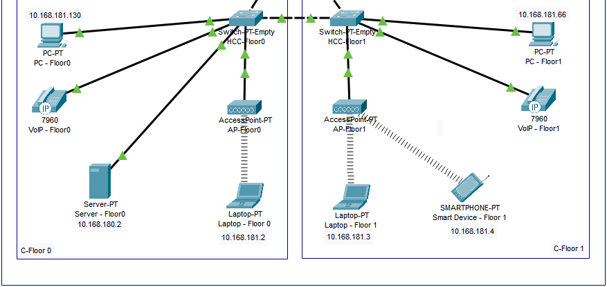
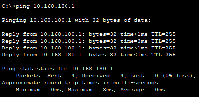
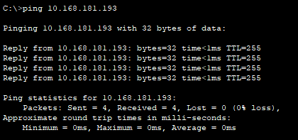

RCOMP 2019-2020 Project - Sprint 2 - Member 1181444 folder
===========================================
### Tiago Soares Ribeiro

-------------------------------------------------------------------

### Building C Topology

This is a printscreen depicting the network topology at building C, the project itself can be found in my own folder under the name 'buildingC.pkt'.

-------------------------------------------------------------------

-------------------------------------------------------------------

## IP Subnetting

**IP Address assigned to building C :** 10.168.180.0/23

- End user outlets on the ground floor: 40 nodes
- End user outlets on floor one: 44 nodes
- Wi-Fi network: 60 nodes
- Local servers, administration workstations, and machines (DMZ): 250 nodes
- VoIP (IP-phones): 40 nodes

To allocate the 250 DMZ nodes, 10.168.180.0/23 was subnetted down to two /24 subnets.

- 10.168.180.0/24 to allocate 254 usable host addresses
- 10.168.181.0/24 to allocate remaining host addresses

To allocate the remaining nodes 10.168.181.0/24 was subnetted down to four /26 subnets.

- 10.168.181.0/26 (64 usable host addresses) to allocate the Wi-Fi 60 required hosts.
- 10.168.181.64/26 (64 usable host addresses) to allocate the First Floor 44 required hosts.
- 10.168.181.128/26 (64 usable host addresses) to allocate the Ground Floor 40 required hosts.
- 10.168.181.192/26 (64 usable host addresses) to allocate the VoIP 40 required hosts.

This subnetting also has room for future scaling within the VLANS.

-------------------------------------------------------------------

The following table will show the attribution of VLAN ID's following the ID's that were assigned to us in the assignment, aswell as the network IP's and their respective gateway.

-------------------------------------------------------------------

| VLAN Location|  VLAN ID   |     Network IP    | Default Gateway |
| ------------ | ---------- | ----------------- | --------------- |
|   Floor 0    |    658     | 10.168.181.128/26 | 10.168.181.129  |
|   Floor 1    |    659     | 10.168.181.64/26  | 10.168.181.65   |
|   Wi-Fi      |    660     | 10.168.181.0/26   | 10.168.181.1    |
|   DMZ	       |    661     | 10.168.180.0/24   | 10.168.180.1    |
|   VoIP       |    662     | 10.168.181.192/26 | 10.168.181.193  |

-------------------------------------------------------------------

## Configurations & Commands

- VLANS were added to the MCC VLAN Database (658 to 662), as MCC is the server and should replicate the database to all "child" layer 2 devices.
	- **MMC(config)#** vlan *vlanNumber*
	- **MMC(config-vlan)#** name *Name*
	- **MMC(config-vlan)#** exit
- ICC interfaces set to trunk mode.
	- **Switch(config)#** interface FastEthernet *interface*
	- **Switch(config-if)#** switchport mode trunk
	- **Switch(config-if)#** exit
- HCC interfaces set to access mode.
	- **Switch(config)#** interface FastEthernet *interface*
	- **Switch(config-if)#** switchport mode access
	- **Switch(config-if)#** exit
- End devices were connected to the HCCs using Copper ST cables.
- Redundancy between HCCs was taken into consideration.
- The HCC interfaces connected to those devices were assigned a specific VLAN:
	- **Switch(config)#** interface FastEthernet *interface*
	- **Switch(config-if)#** switchport access vlan *vlanNumber*
	- **Switch(config-if)#** exit
- Static routes configured on Router.
	- **Router(config)#** ip route *DestinationIP* *SubnetMask* *NextHop*
- Sub-interfaces were assigned to Router5 to match VLANs IDs. These VLAN IDs range from 658 to 662 at my building and they can be matched to a specific area as it can be seen in the table above
	- **Router(config)#** interface FastEthernet0/0.*vlanID*
	- **Router(config-subif)#** encapsulation dot1Q *vlanID*
	- **Router(config-subif)#** ip address *IpAddress(VLAN defaultGateway)* *SubnetMask*
	- **Router(config-subif)#** no shutdown
	- **Router(config-subif)#** exit
- SSIDS configured on Acess Points.
- IP Addresses assigned to all end devices
- Laptops connected to respective Acess Points.

-------------------------------------------------------------------

## ICMP Connectivity Tests (Pings)

The following images show the successfull connectivity tests done between devices where a ping command was made from the Floor 0 to every other device on the network, showing this way that every device is reachable.

-------------------------------------------------------------------

1 - Floor 0 PC to DMZ Gateway

2 - Floor 0 PC to Floor 0 Gateway

3 - Floor 0 PC to Floor 0 Laptop

4 - Floor 0 PC to Floor 0 Server

5 - Floor 0 PC to Floor 1 Gateway

6 - Floor 0 PC to Floor 1 Laptop

7 - Floor 0 PC to DMZ Gateway

8 - Floor 0 PC to ISP Gateway

9 - Floor 0 PC to VoIP Gateway

10 - Floor 0 PC to Wi-Fi Gateway

11 - Floor 0 PC to Floor 1 Smart Device

-------------------------------------------------------------------